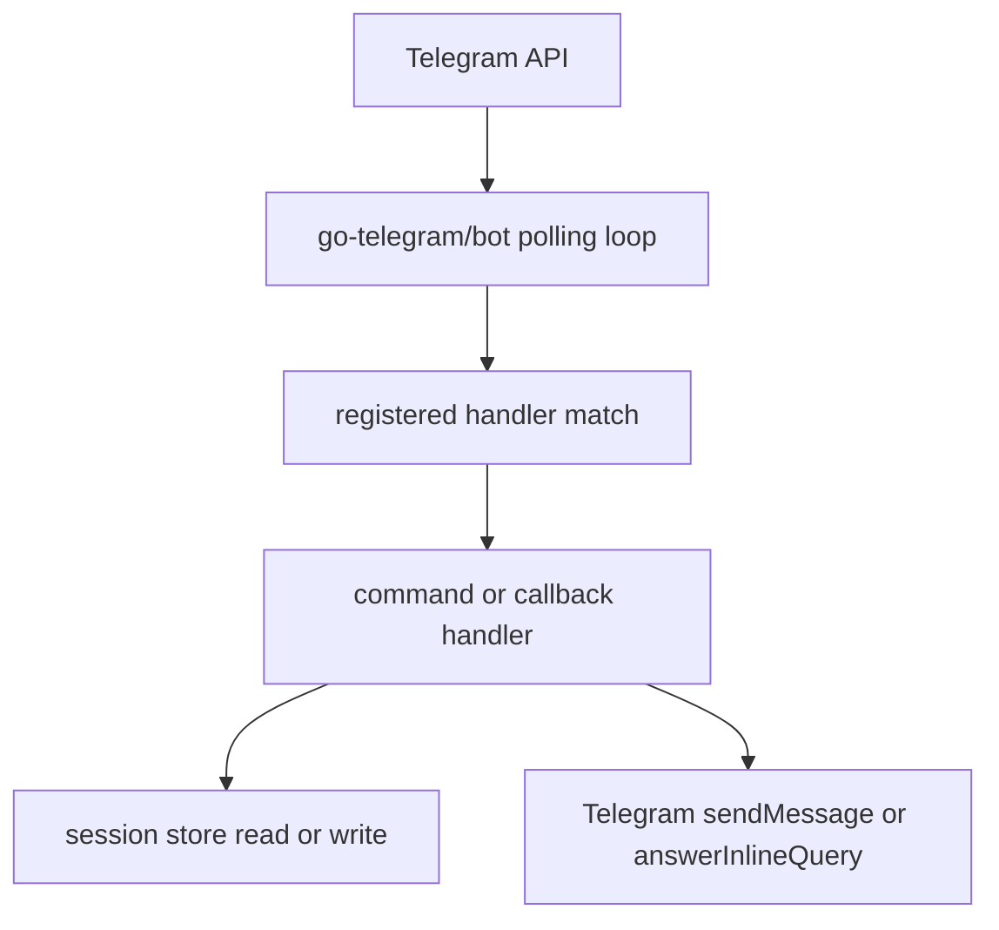
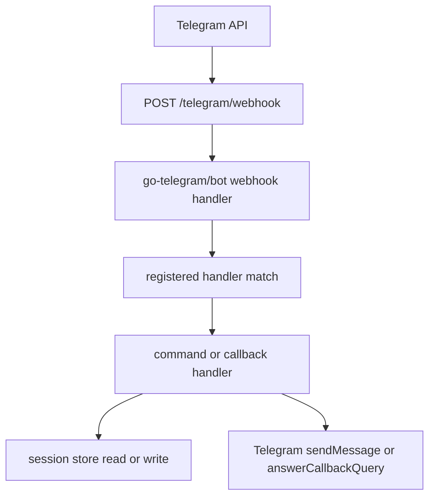

# Request Lifecycle

The template handles two kinds of inbound traffic:

- Telegram updates delivered by polling or webhook mode
- HTTP requests for service metadata and health checks

## Polling mode lifecycle

In polling mode, the bot service calls the Telegram API for updates and handles them inside the Telegram client loop.

Key behavior:

- No public Telegram endpoint is required
- Startup checks existing webhook state and only deletes a webhook when one is actually configured
- The HTTP server still runs for `/`, `/healthz`, and `/readyz`

## Webhook mode lifecycle

In webhook mode, Telegram sends updates to the configured webhook URL.

Key behavior:

- The app registers the webhook during `Prepare()`
- The webhook handler is only mounted when webhook mode is active
- Optional secret-token validation is enabled when `WEBHOOK_SECRET_TOKEN` is set

## Command routing lifecycle

For text messages, the bot package applies registered handlers in order until one matches.

Examples:

- `/start` routes to `handleStart`
- `/echo hello` routes to `handleEcho`
- `menu:session` callback data routes to `handleMenuAction`
- Inline queries route through a match function instead of command text matching

If no text command handler matches, the default handler sends the help message for non-empty text messages.

## Session touch points

Session state is used in a few places already:

- `/start` increments `visits`
- `/help`, `/ping`, `/echo`, `/keyboard`, `/hidekeyboard`, `/menu`, and `/session` update `last_command`
- `/session` increments `session_hits` and reads `last_command`
- Inline menu action `menu:session` increments `session_hits`

This gives you a realistic example of short-lived, chat-scoped state without introducing a larger domain model yet.

## HTTP probe lifecycle

Probe endpoints do not involve Telegram update routing.

### `GET /healthz`

- Returns `200 OK`
- Indicates the process is alive
- Does not call Telegram

### `GET /readyz`

- Creates a short-lived request context
- Calls the bot service `Ping()` method
- `Ping()` delegates to Telegram `GetMe()`
- Returns `200` when Telegram connectivity is healthy and `503` otherwise

That means readiness reflects real upstream bot availability, not just local HTTP availability.