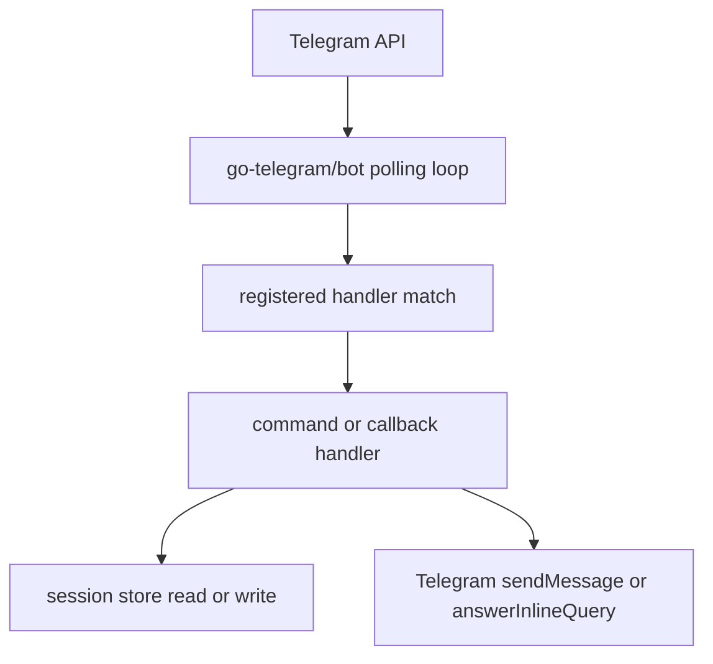
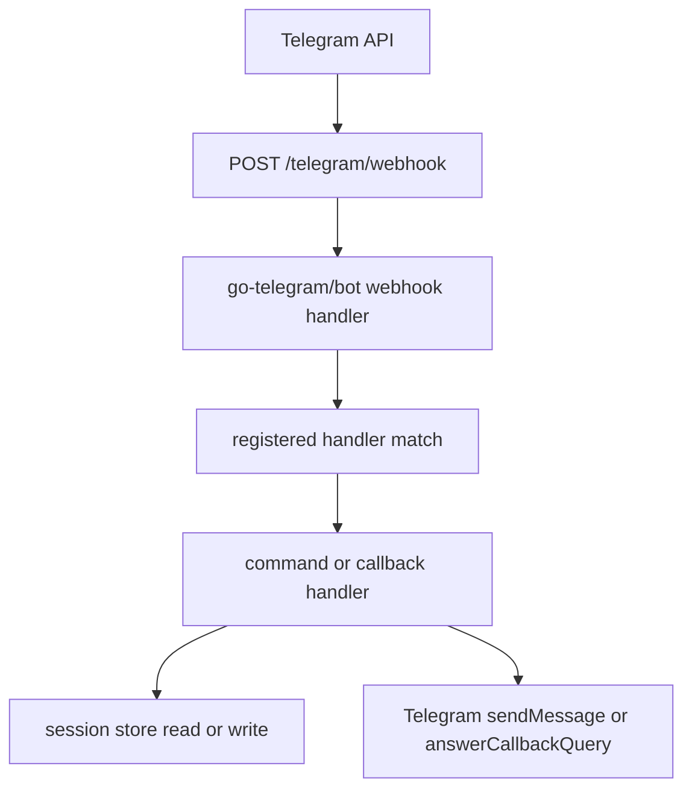

# 請求生命週期

這個模板目前處理兩種 inbound traffic：

- 由 polling 或 webhook 傳入的 Telegram updates
- 用於 metadata 與 health checks 的 HTTP requests

## Polling mode

在 polling mode 中，bot service 會主動向 Telegram API 取 updates，並在 client loop 內處理。

重點：

- 不需要公開 Telegram endpoint
- 啟動時會先檢查現有 webhook 狀態，只在真的有 webhook URL 時才刪除
- HTTP server 仍然會提供 `/`、`/healthz`、`/readyz`

## Webhook mode

在 webhook mode 中，Telegram 會把 update 送到設定好的 webhook URL。

重點：

- webhook 會在 `Prepare()` 階段註冊
- webhook handler 只會在 webhook mode 掛上
- 設定 `WEBHOOK_SECRET_TOKEN` 時會啟用 secret 驗證